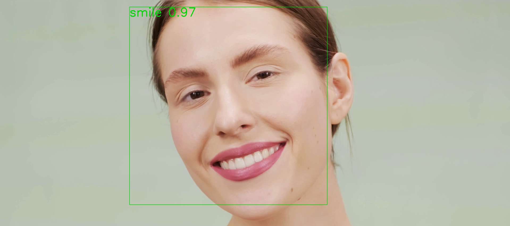

# **Smile Recognition**


Smile Recognition can detect and score the degree of smile for images and videos.

## Initialize

```
git clone https://github.com/ChangMuhan/SmileRecognition.git
cd SmileRecognition
```

```
pip install -r requirements.txt
```

## Prepare Dataset

To download the [GENKI-4K](https://www.kaggle.com/datasets/talhasar/genki4k) Dataset, run:
```
python dataset/download.py
```

Make sure the directory structure looks like this:
```
dataset/
├─ train/
│  ├─ non_smile
│  └─ smile/
│     ├─ file0000.jpg
│     └─ ...
└─ test/
   ├─ non_smile
   └─ smile/
```
You can divide the training and test sets yourself.

## Train

You can change the training configuration in ```config.json```.

To train the model, run:
```
python train.py --config "config.json"
```

## Test for a single image

Input a single image and obtain the smiling score:
```
python test_single_image.py --image "PATH/TO/YOUR/IMAGE" --model "PATH/TO/YOUR/TRAINED/MODEL" --device "cpu"
```

## Test for a video

Input a video, output a video with real-time tracking faces and smile scores:
```
python test_video.py --model "PATH/TO/YOUR/TRAINED/MODEL" --device "cpu" --input_video "PATH/TO/YOUR/INPUT/VIDEO" --output_video "PATH/TO/YOUR/OUTPUT/VIDEO"
```

## Call your camera and score your smile in real time

Coming soon.
